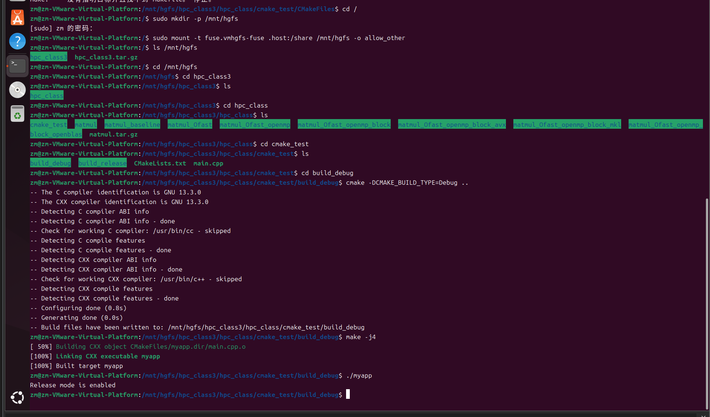
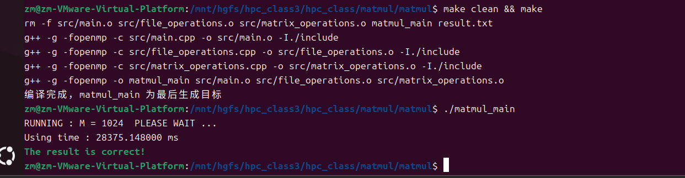
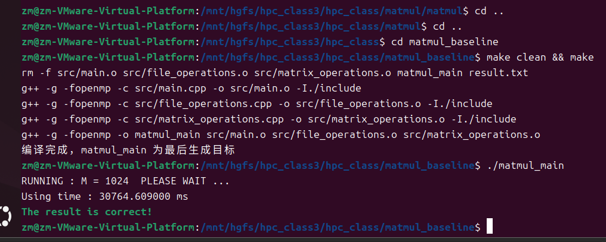
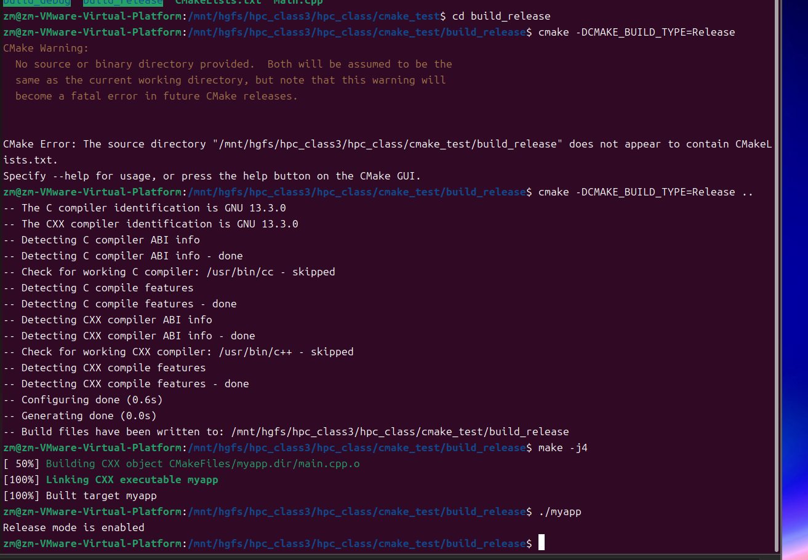
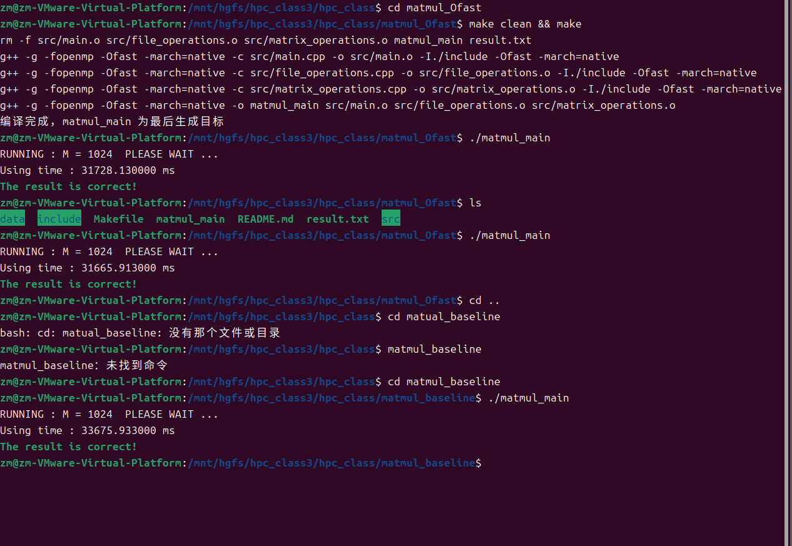
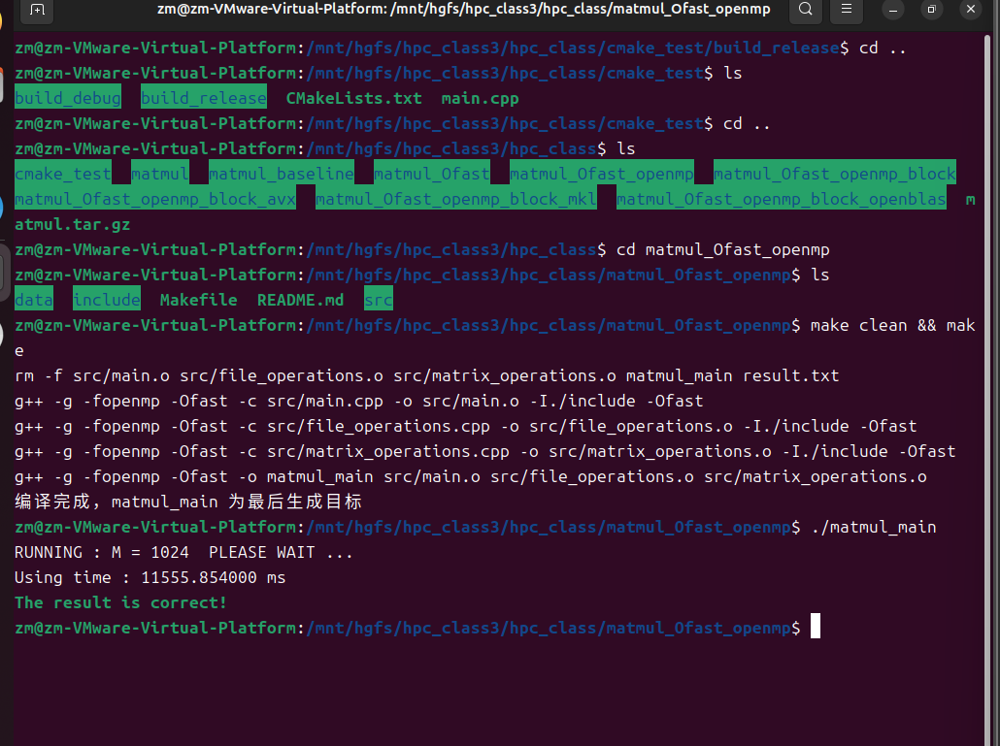
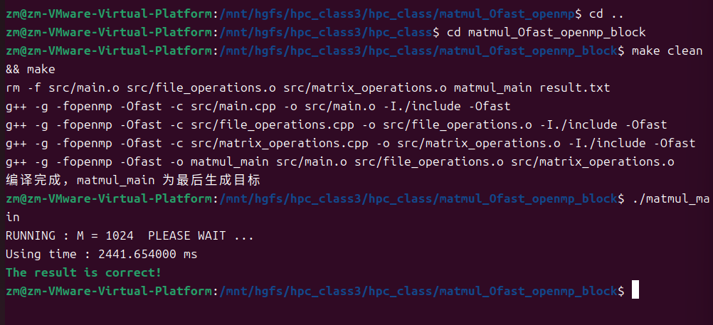
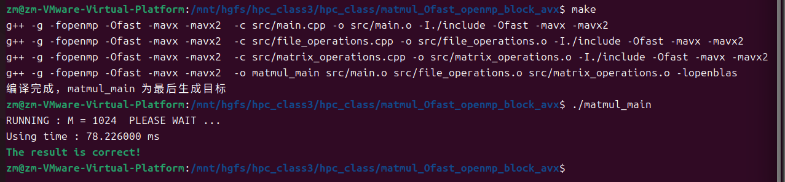
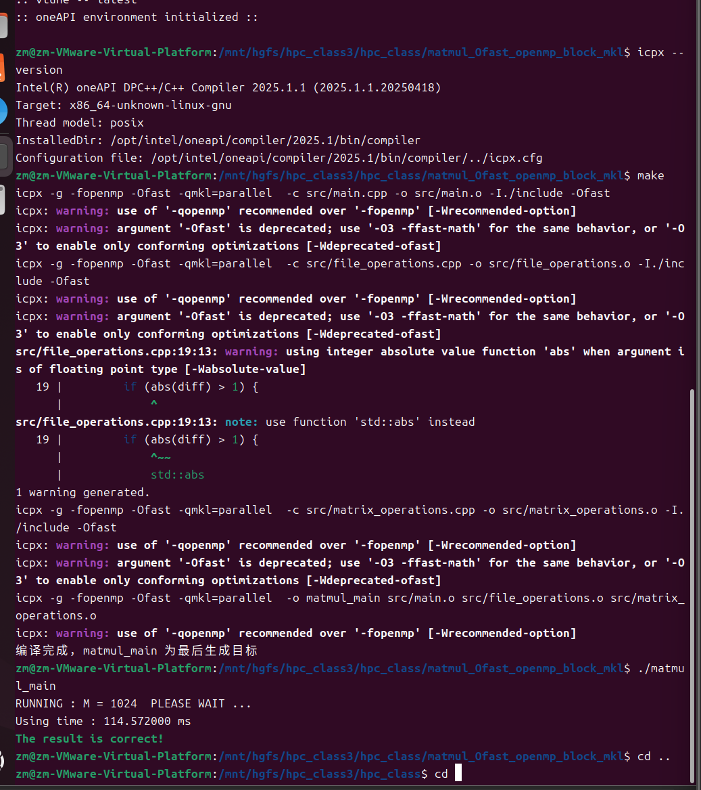
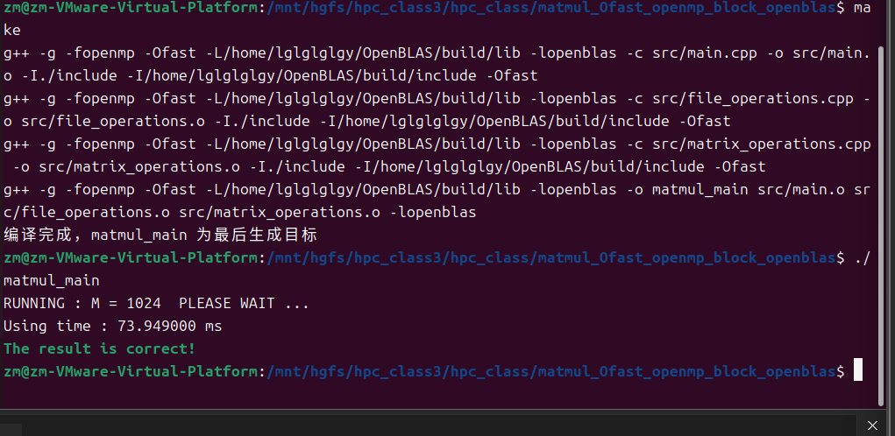

# 挂载共享文件夹
```shell
sudo mkdir -p /mnt/hgfs
sudo mount -t fuse.vmhgfs-fuse .host:/share /mnt/hgfs -o allow_other
```
1. # cmake生成构建系统
- CMakeLists.txt
  项目的构建规则文件，通常放在项目根目录
```shell
cmake_minimum_required(VERSION 3.10) #最低cmake版本
project(MyProject) #项目名称

# 定义一个选项，用于控制是否启用调试模式
option(ENABLE_DEBUG "Enable debug mode" OFF)

# 根据选项的值，设置不同的编译选项
if(ENABLE_DEBUG)
    add_definitions(-DDEBUG)
    set(CMAKE_BUILD_TYPE Debug)
else()
    set(CMAKE_BUILD_TYPE Release)
endif()

# 添加可执行文件
add_executable(myapp main.cpp) #myapp是生成的可执行文件名称，main.cpp是编译所需的源代码文件（可以指定多个文件）
```

debug:        
方法1：直接设置构建类型    
cmake -DCMAKE_BUILD_TYPE=Debug ..      
方法2：启用ENABLE_DEBUG选项      
cmake -DENABLE_DEBUG=ON ..      
release:       
方法1：直接设置构建类型      
cmake -DCMAKE_BUILD_TYPE=Release ..      
方法2：禁用ENABLE_DEBUG选项      
cmake -DENABLE_DEBUG=OFF ..   
2. # matmul    
makefile
```makefile
CXX = g++   // 定义C++编译器为g++，CXX是约定俗成表示C++编译器的变量名

CXXFLAGS =  -g -fopenmp //定义编译选项，-g表示生成调试信息，方便调试程序,-fopenmp 用于开启OpenMP支持，可以实现并行计算

INCLUDE = -I./include //指定头文件搜索路径，-I 是g++指定头文件路径的选项，这里指定为当前目录下的include文件夹

SRC = src/main.cpp src/file_operations.cpp src/matrix_operations.cpp //定义源文件列表
OBJ = $(SRC:.cpp=.o) //通过模式替换，将源文件列表转换为目标文件列表(.cpp后缀转化为.o)
TARGET = matmul_main //定义最终要生成的可执行文件名

all: $(TARGET)     // all 是Makefile的默认目标，这里表示构建的最终目标是生成 $(TARGET)（即可执行文件 matmul_main）
	@echo "编译完成，$(TARGET) 为最后生成目标"

$(TARGET): $(OBJ)
	$(CXX) $(CXXFLAGS) -o $@ $^ //表示生成 $(TARGET)  （可执行文件 matmul_main  ）依赖于 $(OBJ)  （所有目标文件）。

%.o: %.cpp  //模式规则，表示所有 .o  目标文件的构建依赖于对应的 .cpp  源文件。
	$(CXX) $(CXXFLAGS) -c $< -o $@ $(INCLUDE)//使用 g++ 编译器和编译选项，-c选项表示只编译不链接，生成目标文件。$< 表示第一个依赖（即 .cpp  源文件），-o 后接目标文件（ $@ ），同时指定头文件搜索路径 $(INCLUDE)  

clean:
	rm -f $(OBJ) $(TARGET) result.txt  //使用 rm  命令删除所有目标文件 $(OBJ)  、可执行文件 $(TARGET)  以及名为 result.txt  的文件 ， -f  选项表示强制删除，不提示。
```
# 运行matmul
- 进入项目目录
`cd /mnt/hgfs/hpc_class3/hpc_class/matmul`

- 清理并编译
`make clean && make`

- 运行程序（根据README确认参数）
`./matmul_main  # 或实际生成的可执行文件名`


## matmul_baseline基础实现

**30764.609000ms**
## matmul_Ofast使用 `-Ofast` 编译器优化
再makefile中多了以下语句
CXXFLAGS =  -g -fopenmp **-Ofast -march=native**
INCLUDE = -I./include **-Ofast -march=native**
- 先makefile
  
- 
## matmul_Ofast_openmp
```shel
CXXFLAGS =  -g -fopenmp -Ofast

INCLUDE = -I./include -Ofast
```

result:**11555.854000ms**
## matmul_Ofast_openmp_block

**2441.654000ms**
## matmul_Ofast_openmp_block_avx
avx指令集：
```shell
CXXFLAGS =  -g -fopenmp -Ofast -mavx -mavx2

INCLUDE = -I./include -Ofast -mavx -mavx2
```
#include <cblas.h> // 注意需要安装并链接 OpenBLAS
**注意**
**链接OpenBlas要在makefile链接部分**
```shell
$(TARGET): $(OBJ)
	$(CXX) $(CXXFLAGS) -o $@ $^ -lopenblas
```
$(CXX) $(CXXFLAGS) -o $@ $^ **-lopenblas**

## matmul_Ofast_openmp_block_avx_mkl
```makefile
CXX = icpx//变了，从g++变为icpx

CXXFLAGS =  -g -fopenmp -Ofast -qmkl=parallel //链接英特尔数学核心库mkl，并启用并行模式

INCLUDE = -I./include -Ofast 
```
注意：
1. 要使用icpx要安装编译器
   icpx是Intel oneAPI DPC++/C++编译器的驱动程序之一，用于编译C++程序
   能充分利用英特尔架构特性进行优化，提升程序性能；具备先进优化选项，如`-Ofast`；还支持并行编程模型，如OpenMP，SYCL
2. 安装步骤：
  - Intel® oneAPI Base Toolkit
  1. To add APT repository access, enter the command for the installation prerequisites:
   ```shell
   sudo apt update
   sudo apt install -y gpg-agent wget
   ```
  2. To set up the repository, download the key to the system keyring:
  ```shell 
   # download the key to system keyring
   wget -O- https://apt.repos.intel.com/intel-gpg-keys/GPG-PUB-KEY-INTEL-SW-PRODUCTS.PUB \
  | gpg --dearmor | sudo tee /usr/share/keyrings/oneapi-archive-keyring.gpg > /dev/null
  # add signed entry to apt sources and configure the APT client to use Intel repository:
  echo "deb [signed-by=/usr/share/keyrings/oneapi-archive-keyring.gpg] https://apt.repos.intel.com/oneapi all main" | sudo tee /etc/apt/sources.list.d/oneAPI.list
  ```
  3. Update the packages list and repository index:
  ```shell
  sudo apt update
  ```
  4. Install with APT
  ```shell
  sudo apt install intel-oneapi-base-toolkit
  ```
  -  Intel® oneAPI HPC Toolkit 
  1. To add APT repository access, enter the command for the installation prerequisites:
   ```shell
   sudo apt update
   sudo apt install -y gpg-agent wget
   ```
  2. To set up the repository, download the key to the system keyring:
   ```shell
   # download the key to system keyring
   wget -O- https://apt.repos.intel.com/intel-gpg-keys/GPG-PUB-KEY-INTEL-SW-PRODUCTS.PUB 
   | gpg --dearmor | sudo tee /usr/share/keyrings/oneapi-archive-keyring.gpg > /dev/null
   ```
  3. Add the signed entry to APT sources and configure the APT client to use Intel repository:
   ```shell
   echo "deb [signed-by=/usr/share/keyrings/oneapi-archive-keyring.gpg] https://apt.repos.intel.com/oneapi all main" | sudo tee /etc/apt/sources.list.d/oneAPI.list
   ```
  4. Update the packages list and repository index:
   ```shell
   sudo apt update
   ```
  5. Install with APT
   ```shell
   sudo apt install intel-oneapi-hpc-toolkit
   ```
  6. 还需要配置icpx的环境变量
   ```shell
   source /opt/intel/oneapi/setvars.sh
   ```

## 继续matmul_Ofast_openmp_block_avx_mkl

## matmul_Ofast_openmp_block_openblas
```makefile
CXXFLAGS =  -g -fopenmp -Ofast -L/home/lglglglgy/OpenBLAS/build/lib -lopenblas

INCLUDE = -I./include -I/home/lglglglgy/OpenBLAS/build/include -Ofast 
```
注意：这里也要**链接-lopenblas**


