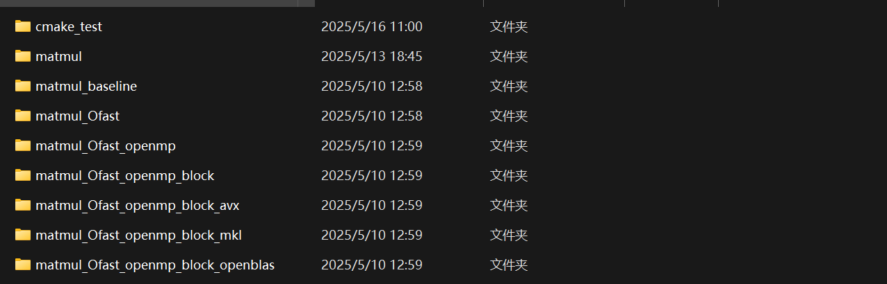

 **1. 目录结构解析**
| 名称 | 优化技术说明 |        
|------|-------------|           
| `matmul baseline` | 基础实现（无优化）|       
| `matmul Ofast` | 使用 `-Ofast` 编译器优化 |      
| `matmul Ofast openmp` | OpenMP多线程并行 |       
| `matmul Ofast openmp_block` | OpenMP + 分块优化 |     
| `matmul Ofast openmp_block_avx` | 上述+AVX指令集 |     
| `matmul Ofast openmp_block_mkl` | 上述+Intel MKL库 |        
| `matmul Ofast openmp_block_openblas` | 上述+OpenBLAS库 |     
| `cmake test` | CMake测试目录 |     
